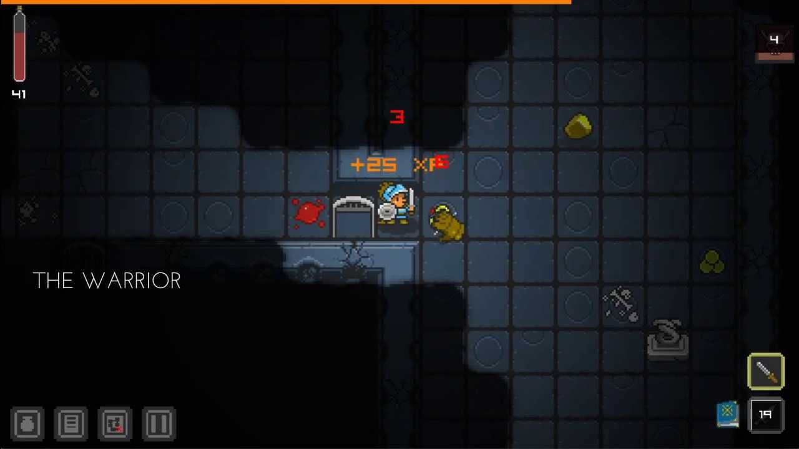

## Dungeon_Game

### INTRO
Dungeon_Game is a dungeon game which is deveploped from cs61B Pooject3. Its main goal is to offer a way to use a world in a set state multiple times by a player (like for a jump'n'run), a group of players (e.g. for a quest dungeon, an adventure map or a PvE arena) or even by groups of groups of players (e.g. for PvP arenas). Dungeon_Game also provides custom game mechanics to make these worlds interesting. It might also be helpful if you want players to build something in creative mode quickly and uncomplicated without any influence on their main world data (inventory, levels etc.).

## FEATURES 
- Create as many dungeons as you wish!
- The instantiation system allows dungeons to be played by multiple groups of players at the same time without clashes.
- Dungeons are accessable through portals in one of your main worlds. 
- Invite players to edit single dungeons without the need to give them any further permissions. 
- Allow players to build in creative mode safely without any influence to their game progress in the main worlds!
- Set checkpoints, breakable blocks, triggers, messages and much more through signs in the edit mode. 
- Per dungeon configuration (you should try that after you became familiar with the basics of this plugin). 
- Link multiple floors together to create large dungeons with multiple levels. 
- Use a dungeon as a tutorial and give them a PEX group when they finish it.
- Players can play the dungeon with their own items or with configurable classes.
- The classes support doges!
- PvP
- Time limits
- Different game types allow you to use your maps dynamically for different purposes. 
- Per dungeon resource packs
...and many more!

